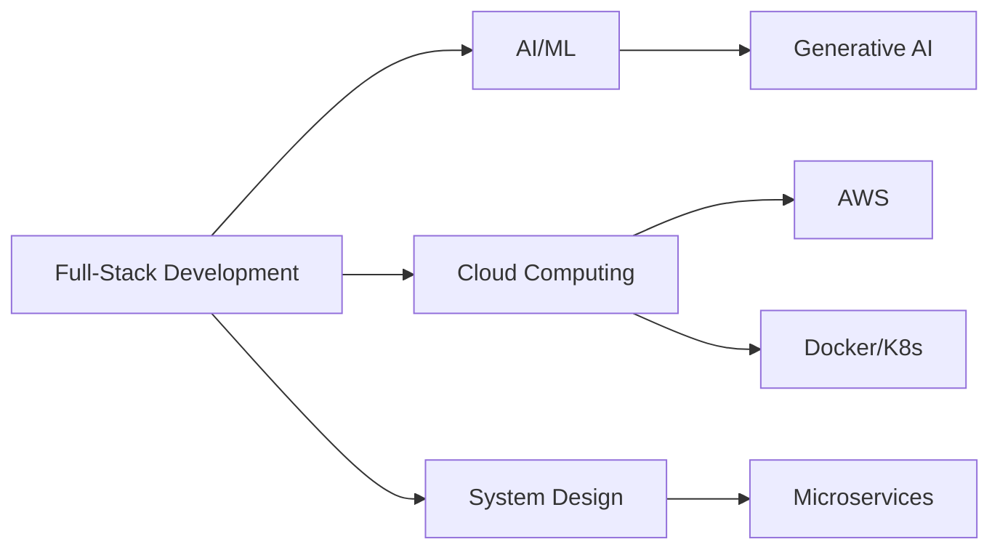

<h1 align="center">
  
</h1>

<h3 align="center">
  
  Building the Future, One Line of Code at a Time
  
</h3>

<p align="center">
  
  
  
</p>

---

<div align="center">
  
</div>

---

## 🌟 About Me

<div align="center">

| 🎯 | 💡 |
|---|---|
| **🚀 Role** | Software Engineering Undergraduate |
| **📍 Location** | Sri Lanka 🇱🇰 |
| **💻 Focus** | Full-Stack Development & AI |
| **🎓 Learning** | Docker, Kubernetes, AWS |
| **✨ Mission** | Build AI-Powered Solutions |

</div>

```javascript
const githmi = {
  name: "M.K.D. Githmi Thathsarani",
  role: "Full-Stack Developer",
  location: "Sri Lanka 🇱🇰",
  passions: ["Full-Stack Development", "Artificial Intelligence", "Cloud Computing"],
  currentlyLearning: ["Docker", "Kubernetes", "AWS", "Microservices"],
  funFact: "I debug code while listening to Lofi 🎧",
  motto: "Code, Learn, Innovate, Repeat 🔄"
};
```

---

## 🛠️ Tech Stack

### 🌐 Frontend Development
<p align="center">
  
  
  
  
  
  
  
  
</p>

### ⚙️ Backend Development
<p align="center">
  
  
  
  
  
  
  
</p>

### 🗄️ Database & Storage
<p align="center">
  
  
  
  
  
  
</p>

### ☁️ DevOps & Cloud
<p align="center">
  
  
  
  
  
  
</p>

---

## 🚀 Featured Projects

<div align="center">

| 🏆 Project | 🛠️ Tech Stack | 📝 Description |
|------------|---------------|----------------|
| 💊 **[Pharmacy Management](https://github.com/MKDGThathsarani/pharmacy-management-system)** | PHP, MySQL, Bootstrap | Full-featured ePharmacy with admin panel & cart |
| 💇 **[Salon-Hadakari](https://github.com/MKDGThathsarani/Salon-Hadakari)** | HTML, CSS, JS | Premium salon booking website |
| 📇 **[Contacts Organizer](https://github.com/MKDGThathsarani/ContactsOrganizer)** | Java | CLI contact manager with validation |
| 🍔 **[Other_Buddy](https://github.com/MKDGThathsarani/Other_Buddy)** | HTML, CSS, JS | Modern food ordering interface |
| 💼 **[Portfolio](https://github.com/MKDGThathsarani/Professional_portfolio)** | React, Node.js | Professional portfolio website |

</div>

---

## 📊 GitHub Analytics

<div align="center">
  
  
</div>

<div align="center">
  
</div>

---

## 🏆 GitHub Achievements

<div align="center">
  
</div>

---

## 🎯 Current Focus

<div align="center">



</div>

---

## 🎨 Skills & Interests

<div align="center">

| 🖥️ Development | 🤖 AI/ML | ☁️ Cloud | 🏗️ Architecture |
|----------------|----------|---------|-----------------|
| React.js | TensorFlow | AWS | Microservices |
| Node.js | PyTorch | Docker | System Design |
| Python | Scikit-learn | Kubernetes | Scalability |
| Java | NLP | Serverless | Performance |

</div>

---

## 📫 Let's Connect!

<div align="center">
  <a href="https://linkedin.com/in/m-k-d-githmi-thathsarani-91754a297">
    
  </a>
  <a href="https://github.com/MKDGThathsarani">
    
  </a>
  <a href="https://facebook.com/profile.php?id=100088705981957">
    
  </a>
  <a href="mailto:githmithathsarani@gmail.com">
    
  </a>
</div>

---

## 💬 Quote of the Day

<div align="center">
  
</div>

---
